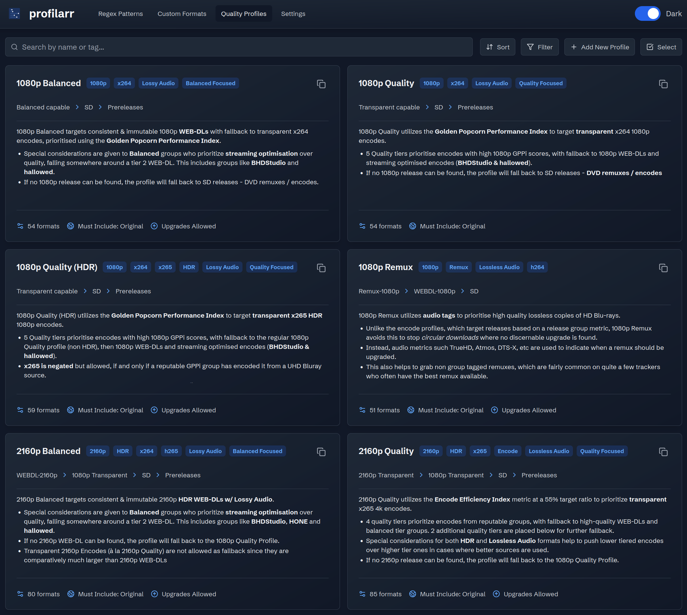

# Profilarr

[](https://github.com/Dictionarry-Hub/profilarr/releases)
[](https://hub.docker.com/r/santiagosayshey/profilarr)
[](https://github.com/Dictionarry-Hub/profilarr/blob/main/LICENSE)
[](https://dictionarry.dev/)
[](https://discord.com/invite/Y9TYP6jeYZ)
[](https://www.buymeacoffee.com/santiagosayshey)
[](https://github.com/sponsors/Dictionarry-Hub)

Configuration management tool for Radarr/Sonarr that automates importing and version control of custom formats and quality profiles.



## Features

-   🔄 Automatic synchronization with remote configuration databases
-   🎯 Direct import to Radarr/Sonarr instances
-   🔧 Git-based version control of your configurations
-   ⚡ Preserve local customizations during updates
-   🛠️ Built-in conflict resolution

## Getting Started

### Quick Installation

```yaml
services:
    profilarr:
        image: santiagosayshey/profilarr:latest # Use :beta for early access to new features
        container_name: profilarr
        ports:
            - 6868:6868
        volumes:
            - /path/to/your/data:/config # Replace with your actual path
        environment:
            - TZ=UTC # Set your timezone
        restart: unless-stopped
```

After deployment, access the web UI at `http://[address]:6868` to begin setup.

> **Note for Windows users:** The database is case-sensitive. Use a docker volume or the WSL file system to avoid issues:
>
> -   Docker volume example: `profilarr_data:/config`
> -   WSL filesystem example: `/home/username/docker/profilarr:/config`

### Complete Documentation

Visit our comprehensive documentation at [dictionarry.dev/wiki/profilarr-setup](https://dictionarry.dev/wiki/profilarr-setup) for detailed installation instructions and usage guides.

## Support

### Need Help?

-   **Bug Reports & Issues**: Submit technical issues via our [GitHub Issues tracker](https://github.com/Dictionarry-Hub/profilarr/issues)
-   **Community Support**: Join our [Discord community](https://discord.com/invite/Y9TYP6jeYZ) for help from developers and other users
-   **Database Issues**: Please direct database-specific issues to their respective repositories, as this repository focuses exclusively on Profilarr development

## Contributing

We welcome contributions from the community! Here's how you can help improve Profilarr:

-   **Pull Requests**: Feel free to submit PRs for bug fixes or new features
-   **Feature Suggestions**: Share your ideas through GitHub issues
-   **Documentation**: Help improve our guides and documentation
-   **Testing**: Try new features and report any issues

Detailed contributing guidelines will be available soon. Join our Discord to discuss potential contributions with the development team.

## Status

Currently in beta. Part of the [Dictionarry](https://github.com/Dictionarry-Hub) project to simplify media automation. 

### Known Issues
- Light Mode is not working
- Renaming / Deleting files can be a little wonky - if you expect to stay connected with a database, try to limit deleting / renaming files.
- State management for custom format conditions is also a little wonky on chromium based browsers

### Development
- Currently focused on fixing bugs found in open beta
- 1.1 will focus on improving the 'setup' side of profilarr - adding media management / quality settings syncs
